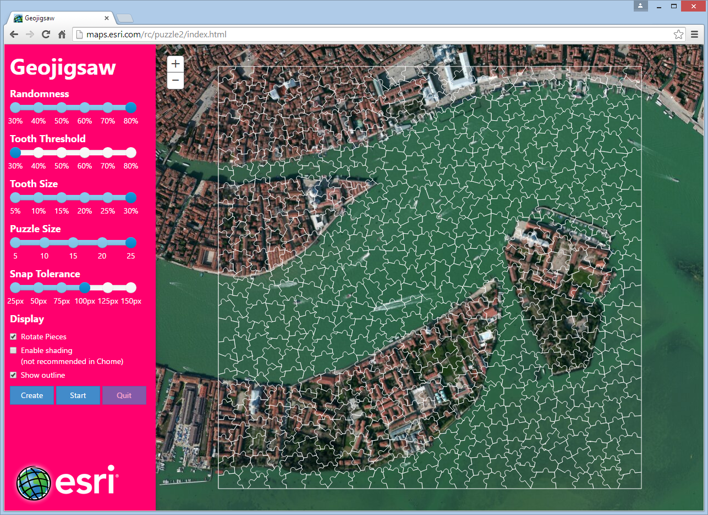
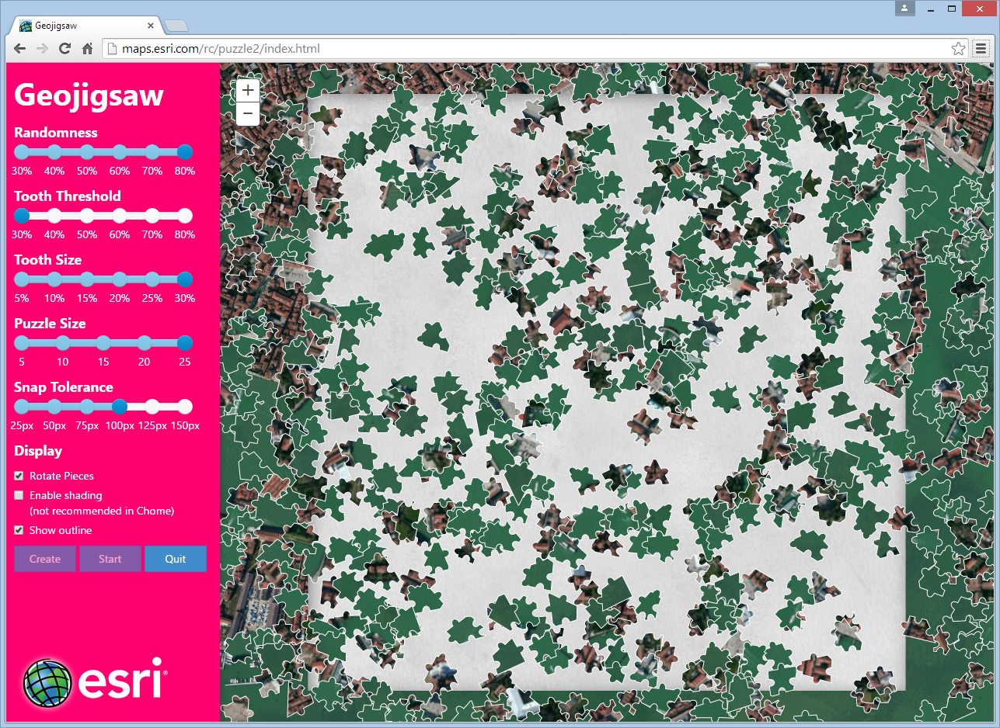

# Esri-Geojigsaw

This application converts a map view into an interactive jigsaw puzzle.

Click [here](http://richiecarmichael.github.io/geojigsaw/index.html) or [here](http://maps.esri.com/rc/puzzle2/index.html) to view the live application.

The application is derived from a JavaScript game developed late year by the same name. See [here](http://blogs.esri.com/esri/apl/2014/11/18/geojigsaw/) for the corresponding blog posting with links to the live application and source code.

#### A new puzzle for Venice, Italy

#### The puzzle scrambled

